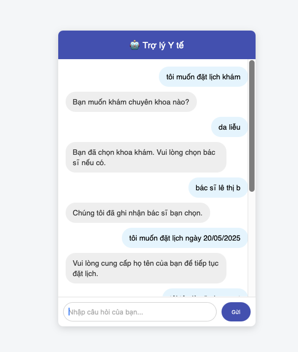
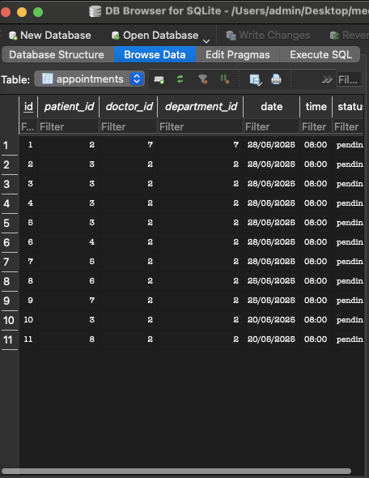

# Medical Chatbot NLP


## 📝 Short Description

This is a Vietnamese-language chatbot built with Natural Language Processing (NLP) techniques and Machine Learning to support **medical appointment scheduling**. It can understand user intent, extract key information (like name, phone number, and symptoms), and store appointments in a local database.

## 🌟 Overview

**Medical Chatbot NLP** là một chatbot tiếng việt được xây dựng với ngôn ngữ tự nhiên và huấn luyện mô hình học máy để hỗ trợ tư vấn và đặt lịch hỗ trợ người bệnh. Chatbot có thể phân biệt được các ý định, nắm bắt chính xác các thông tin cá nhân của bệnh nhân (như tên, tuổi, số điện thoại, ngày tháng trừu tượng, ...). Ngoài ra hệ thống còn tích hợp database để lưu trữ lịch hẹn, thông tin bệnh nhân, thông tin bác sĩ chuyên khoa, các triệu chứng.

### ⚡ Features

- Nhập dữ liệu từ đa dạng file như excel, csv hay databaase.
- Làm sạch và chuẩn hóa dữ liệu ETL.
- Lưu trữ vào SQLite để sử dụng về sau.
- Phản hồi nhanh chóng.
- Giao diện dễ sử dụng.

> 

> 

---

## 🛠️ Công nghệ sử dụng

- Python (pandas, requests, sqlite3)
- SQLite
- Streamlit / Dash (cho dashboard)
- FastAPI / Flask (cho API server)
- NLP/Học máy: PhoBERT

---

## 📁 Cấu trúc thư mục chính

```
medical_appointment_chatbot/
├── data/                     # Dữ liệu huấn luyện mẫu
├── src/
│   ├── chatbot/
│   │   ├── init.py
│   │   ├── dialogue_manager.py     # Điều phối luồng hội thoại
│   │   ├── dialogue_flow.py        # Logic kịch bản hội thoại
│   │   ├── nlp_processor.py        # Tiền xử lý và phân tích ngôn ngữ
│   │   ├── entity_recognizer.py    # Trích xuất thực thể (tên, SĐT, thời gian)
│   │   ├── intent_classifier.py    # Phân loại ý định (đặt lịch, hỏi thông tin,...)
│   │   ├── response_generator.py   # Tạo câu trả lời phù hợp
│   │   └── database/
│   │       ├── database.py         # Giao tiếp SQLite (lưu & truy vấn lịch hẹn)
│   │       └── medical_chatbot.db  # (bị loại khỏi Git) Cơ sở dữ liệu SQLite
│   ├── models/                   # (bị loại khỏi Git) Lưu mô hình phân loại ý định .pkl
│   └── templates/
│       └── index.html            # Giao diện web (nếu có)
├── intents.json                 # Tập dữ liệu intent mẫu (tag - patterns - responses)
├── app.py                      # Flask app khởi chạy chatbot
├── README.md                   # Mô tả dự án
├── requirements.txt            # Thư viện cần thiết
└── .gitignore                  # Loại bỏ các file không cần theo dõi
```
---

